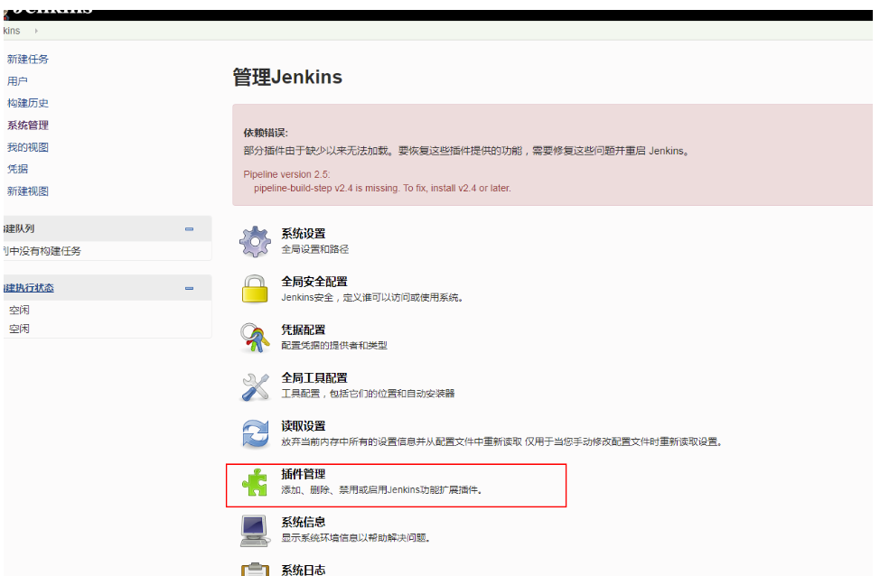

# jenkins插件下载镜像加速

## jenkins插件清华大学镜像地址

```
https://mirrors.tuna.tsinghua.edu.cn/jenkins/updates/update-center.json
```

## 更换地址方法

1.进入jenkins系统管理
2.进入插件管理images/




3.点击高级，修改升级站点的地址为清华大学镜像地址


## 修改host

```
# jenkins
127.0.0.1 updates.jenkins-ci.org
```


## 添加nginx配置

```nginx
server {
    listen       80;
    server_name  updates.jenkins-ci.org;

	location /download/plugins {
	    proxy_next_upstream http_502 http_504 error timeout invalid_header;
	    proxy_set_header Host mirrors.tuna.tsinghua.edu.cn;
	    proxy_set_header X-Real-IP $remote_addr;
	    proxy_set_header X-Forwarded-For $proxy_add_x_forwarded_for; 
	    rewrite /download/plugins(.*) /jenkins/plugins/$1 break;
	    proxy_pass https://mirrors.tuna.tsinghua.edu.cn;
	}

	location /static {
	    proxy_next_upstream http_502 http_504 error timeout invalid_header;
	    proxy_set_header Host mirrors.tuna.tsinghua.edu.cn;
	    proxy_set_header X-Real-IP $remote_addr;
	    proxy_set_header X-Forwarded-For $proxy_add_x_forwarded_for; 
	    proxy_pass https://mirrors.tuna.tsinghua.edu.cn;
	}
}
```

